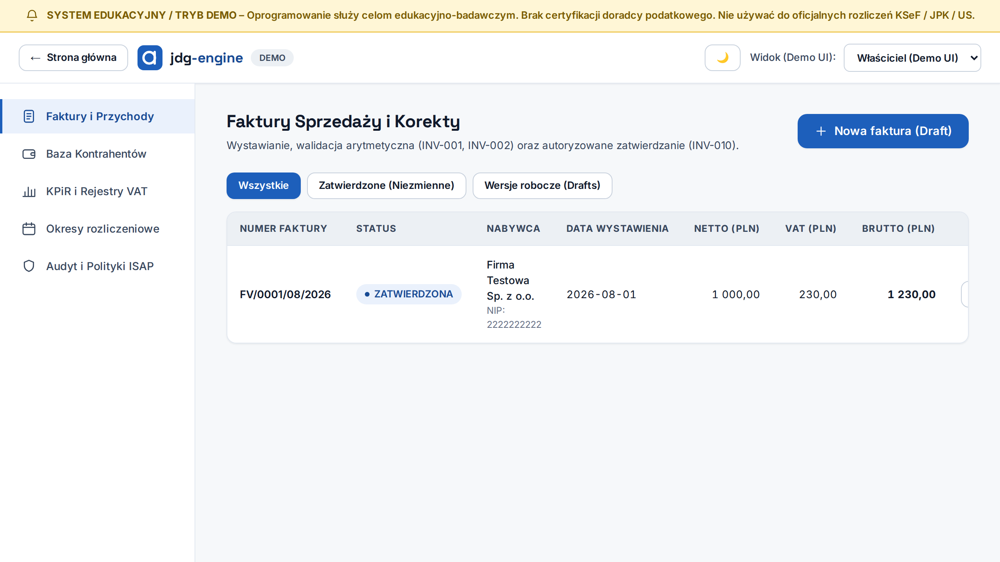
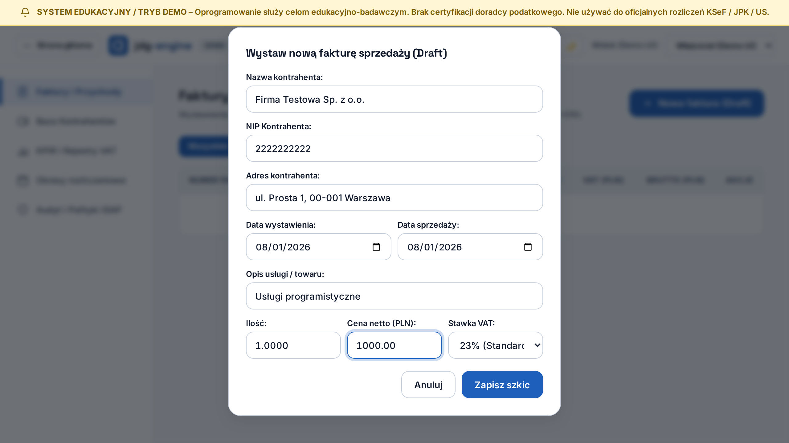
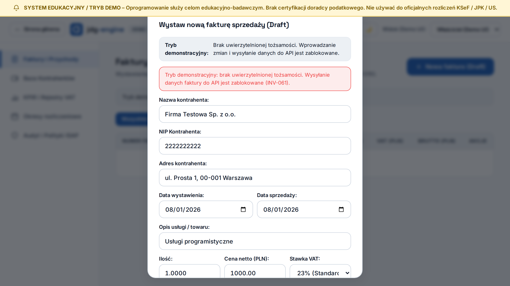

# Silnik Księgowy JDG — Prezentacja Architektury i Niezmienników

[](README.md)
[](README.md)
[-orange)](README.md)

Statyczna demonstracja architektoniczna polskiego silnika księgowego dla jednoosobowej działalności gospodarczej (JDG). Repozytorium stanowi publiczną wizytówkę rozwiązań projektowych w zakresie niezmienników finansowych, determinizmu obliczeń oraz dwupoziomowej ochrony integralności danych.

> [!IMPORTANT]
> **Charakter publikacji:** Niniejsze repozytorium **nie jest kopią kodu produkcyjnego ani działającą aplikacją live demo**. Jest to statyczny raport dokumentujący rzeczywisty, zautomatyzowany przebieg testów Playwright i PostgreSQL w wyizolowanym środowisku lokalnym.
> 
> **Zastrzeżenie edukacyjno-prawne:** Projekt służy celom badawczo-edukacyjnym. Nie stanowi komercyjnego oprogramowania księgowego i nie zastępuje doradztwa podatkowego. Wszystkie prezentowane dane (nazwy, NIP, adresy, kwoty) są w 100% syntetyczne, a elementy identyfikacyjne aplikacji zostały zanonimizowane do neutralnego oznaczenia `jdg-engine`.

---

## 1. Architektura Heksagonalna i Przepływ Danych

System rozdziela odpowiedzialności zgodnie z zasadami czystej architektury. Reguły prawa podatkowego i obliczenia monetarne są całkowicie odseparowane od warstw zewnętrznych:

```text
 ┌─────────────────────────────────────────────────────────┐
 │               Warstwa Prezentacji (UI)                  │
 │   React 19 / TypeScript (wyłącznie odczyt i format)     │
 │   ZAKAZ: kalkulacji kwot podatków i sumowania w UI      │
 └────────────────────────────┬────────────────────────────┘
                              │ HTTP / OpenAPI Client
                              │ (Typy String Decimal, Idempotency-Key)
                              ▼
 ┌─────────────────────────────────────────────────────────┐
 │                  Interfejs API (FastAPI)                │
 │   Kontrola schematów Pydantic, weryfikacja uprawnień    │
 └────────────────────────────┬────────────────────────────┘
                              │
                              ▼
 ┌─────────────────────────────────────────────────────────┐
 │                   Warstwa Aplikacyjna                   │
 │   Przypadki użycia, transakcje, audyt, idempotencja     │
 └────────────────────────────┬────────────────────────────┘
                              │
                              ▼
 ┌─────────────────────────────────────────────────────────┐
 │                    Warstwa Domenowa                     │
 │   Deterministyczne reguły księgowe (Python Decimal)     │
 │   Algorytm sumy kontrolnej NIP (Modulo-11)              │
 │   Maszyna stanów dokumentu (DRAFT ➔ VALID ➔ APPROVED)   │
 └────────────────────────────┬────────────────────────────┘
                              │
                              ▼
 ┌─────────────────────────────────────────────────────────┐
 │                Infrastruktura i Baza Danych             │
 │   PostgreSQL: Row-Level Security (RLS),                 │
 │   Triggery blokujące modyfikację (Append-Only),         │
 │   Kryptograficzne skróty wersji dokumentów (SHA-256)    │
 └─────────────────────────────────────────────────────────┘
```

---

## 2. Niezmienniki Finansowe i Obrona w Głąb

| Reguła | Założenie niezmiennicze | Realizacja techniczna |
| :--- | :--- | :--- |
| **INV-001** | `Netto + VAT = Brutto` | Liczone wyłącznie w domenie backendu z użyciem `Decimal` i zaokrągleniem `ROUND_HALF_UP`. Bezwzględny zakaz `float`. |
| **INV-002** | Rekoncyliacja pozycji z nagłówkiem | Suma pozycji wierszy musi zgadzać się co do grosza z sumarycznymi polami faktury przed zatwierdzeniem. |
| **INV-010** | Niezmienność zatwierdzonych zapisów | Baza danych PostgreSQL egzekwuje regułę *append-only* — wyzwalacze (triggery) blokują `UPDATE` i `DELETE` na zatwierdzonych rekordach `invoice`. |
| **INV-030** | Ochrona przed powtórzeniem (Idempotencja) | Wymuszony unikalny nagłówek `Idempotency-Key` dla operacji mutujących. Powtórzenie żądania z identyczną treścią zwraca ten sam wynik; zmiana treści powoduje wygenerowanie nowego klucza lub konflikt `409`. |
| **INV-060** | Separacja podmiotów (RLS) | Dwuwarstwowa izolacja: filtr `business_profile_id` w zapytaniach aplikacji oraz niezależna bariera Row-Level Security w PostgreSQL. |
| **INV-061** | Ochrona przed ujawnieniem (Non-Disclosure) | Dwuetapowa bariera: blokada w interfejsie użytkownika (brak wysłania żądania bez tożsamości) oraz odpowiedź `404 Not Found` zamiast `403 Forbidden` w API przy braku dostępu. |

---

## 3. Rzeczywisty Przebieg Testowy (Dowody Wizualne)

Poniższe materiały pochodzą z zautomatyzowanego przebiegu testów przeglądarkowych Chromium w środowisku Playwright, współpracującego z lokalną instancją bazy PostgreSQL.

### Zrzut 1: Zatwierdzona faktura i persystencja w PostgreSQL
Docelowy stan systemu po poprawnym przejściu cyklu życia dokumentu i wywołaniu `page.reload()`. Widok potwierdza bezpośredni odczyt danych z bazy danych PostgreSQL (nie z pamięci podręcznej klienta): kanoniczny numer `FV/0001/08/2026`, status `ZATWIERDZONA`, pełna rekoncyliacja kwot: netto `1 000,00 PLN`, VAT `230,00 PLN`, brutto `1 230,00 PLN` dla kontrahenta syntetycznego `Firma Testowa Sp. z o.o.`.



### Zrzut 2: Formularz wystawienia szkiku (Przypadek GOLDEN-003)
Formularz rejestracji nowej faktury wypełniony w sesji, w której aktywna jest **kontrolowana tożsamość testowa** (Właściciel). Wprowadzone dane odpowiadają syntetycznemu przypadkowi testowemu `GOLDEN-003` (jedna pozycja usługowa, stawka podstawowa 23% VAT STANDARD):



### Zrzut 3: Kontrolowana odmowa zapisu w trybie demonstracyjnym
Weryfikacja zachowania systemu w publicznym trybie demonstracyjnym (bez aktywnej tożsamości testowej):
1. **Bariera UI:** Formularz wyświetla ostrzeżenie o braku uprawnień i **blokuje wysłanie żądania sieciowego HTTP do API**, zapobiegając emisji nieautoryzowanych danych.
2. **Komunikat ochronny:** Interfejs prezentuje informację o blokadzie w oparciu o regułę `INV-061`.
3. **Bariera API (Backend):** W scenariuszach integracyjnych bezpośrednie wywołanie API bez uprawnień skutkuje odmową `404 Not Found` (blokada enumeracji zasobów).



> [!NOTE]
> **Informacja o pominięciu pliku wideo:**  
> Dynamiczne nagranie ekranu zostało celowo wyłączone z publikacji w niniejszym repozytorium. W początkowych klatkach rozbiegowych rejestratora przeglądarki występowały elementy identyfikacyjne środowiska lokalnego. Zgodnie z zasadą minimalizacji i ochrony prywatności, publiczna wizytówka opiera się wyłącznie na zweryfikowanych statycznych zrzutach ekranu o w pełni kontrolowanej zawartości.

---

## 4. Zakres Domenowy i Ograniczenia

- **Obsługiwany przypadek referencyjny (`GOLDEN-003`):**
  - Sprzedaż krajowa w walucie PLN,
  - Podatnik rozliczający się na zasadach ogólnych (skala podatkowa),
  - Jedna pozycja towarowo-usługowa ze stawką 23% VAT (STANDARD),
  - Podstawowy termin płatności i brak mechanizmów szczególnych.
- **Otwarte zagadnienia prawne (`LEGAL-CHECK-002`):**
  - Zaokrąglenia algorytmiczne faktur wielopozycyjnych o zróżnicowanych stawkach VAT pozostają otwartym punktem weryfikacyjnym.
  - Mechanizm podzielonej płatności (MPP) oraz transakcje walutowe wymagają kolejnych pakietów reguł ISAP.
- **Zasada Fail-Closed:**
  - Wszelkie nieobsługiwane kombinacje stawek, brak zweryfikowanej polityki podatkowej lub niejednoznaczności formalne skutkują natychmiastowym zatrzymaniem operacji i odmową rejestracji dokumentu.

---

## 5. Zakres i Źródła Wyników Testów

Wiarygodność rozwiązań opiera się na wyodrębnionych zestawach testowych wykonywanych deterministycznie:

| Zakres testowy | Polecenie uruchomieniowe | Środowisko wykonania | Obserwowany wynik |
| :--- | :--- | :--- | :--- |
| **Testy jednostkowe domeny** | `uv run pytest tests/unit` | Lokalne środowisko Python 3.12+ (233 testy) | ✅ Wszystkie testy zaliczone (brak błędów precyzji `Decimal`) |
| **Testy integracyjne i RLS** | `uv run pytest tests/integration` | PostgreSQL z aktywnymi rolami i RLS (146 testów) | ✅ Wszystkie asercje spełnione |
| **Kontrola granic i kontraktów** | `make check-boundaries`, `make check-contracts` | Analiza AST i driftu schematów OpenAPI / TypeScript | ✅ Brak nieuprawnionych zależności architektonicznych |
| **Testy E2E Playwright** | `bash scripts/tests/run_e2e_playwright.sh` | Headless Chromium + jednorazowa baza challenged PostgreSQL (12 testów: 7 UI + 5 API) | ✅ Wszystkie testy zaliczone |
| **Status Continuous Integration** | GitHub Actions Workflow (`verify`) | Wyizolowany runner Ubuntu na gałęzi PR #1 | ✅ Wynik potwierdzony przez właściciela repozytorium |
